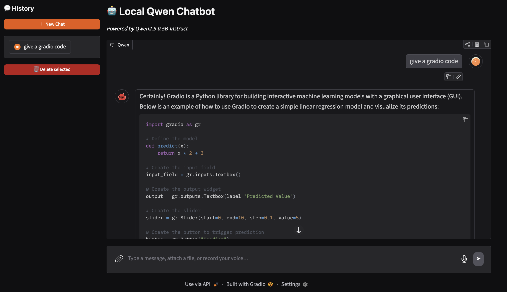
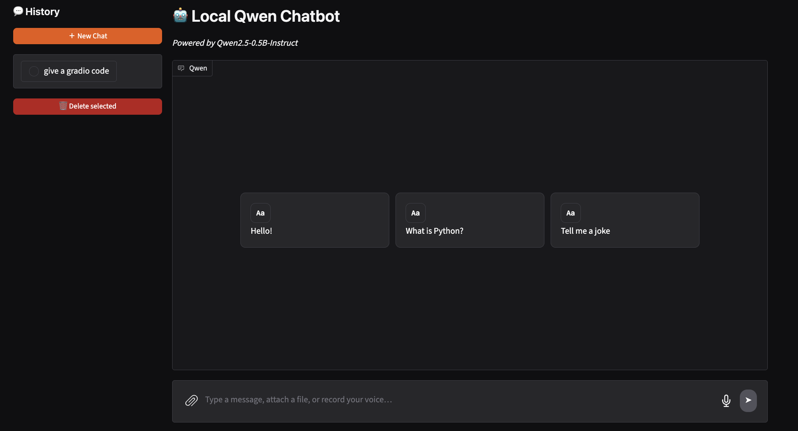

# 🤖 Local Qwen Chatbot

A local, privacy-friendly chatbot web app powered by **Qwen2.5-0.5B-Instruct**, built with [Gradio](https://www.gradio.app/) for the UI. Chat with the model entirely on your own machine — no external API calls, no data leaving your system.

  

---

## ✨ Features

- **Runs locally** — powered by the lightweight `Qwen2.5-0.5B-Instruct` model, no internet connection required at inference time.
- **Clean chat interface** with a dark theme, message input box, file attachment, and voice recording support.
- **Conversation history sidebar** — start a **New Chat**, revisit past conversations, or delete selected ones.
- **Quick-start prompts** — suggested starter messages ("Hello!", "What is Python?", "Tell me a joke") to get the conversation going instantly.
- **Code-aware responses** — the model can generate and explain code (e.g. Gradio app examples) with syntax-highlighted code blocks and a copy button.
- **Built with Gradio**, exposing both a web UI and an API endpoint (`Use via API`).

## 📸 Preview

**Landing screen with quick-start suggestions:**
The home screen greets users with the "Local Qwen Chatbot" header, model info, and a set of clickable example prompts to begin chatting.

**Live conversation example:**
Asking the bot *"give a gradio code"* returns a full explanation along with a working, syntax-highlighted Python code snippet using the Gradio library.

## 📁 Project Structure

```
CHATBOT/
├── Qwen2.5-0.5B-Instruct/    # Local model files/weights
├── .gitignore                # Files/folders excluded from git
├── chat_history.json         # Stored conversation history
├── chat.py                   # Core chat logic (message handling, model calls)
├── config.py                  # App configuration and settings
├── history.py                 # Logic for loading/saving/managing chat history
├── main.py                    # Application entry point
├── model.py                   # Model loading and inference logic
└── ui.py                      # Gradio UI layout and components
```

### File Overview

| File | Purpose |
|---|---|
| `main.py` | Entry point — launches the Gradio app. |
| `ui.py` | Defines the Gradio interface: chat window, sidebar, buttons, and layout. |
| `chat.py` | Handles sending/receiving messages and coordinating responses. |
| `model.py` | Loads `Qwen2.5-0.5B-Instruct` and runs inference to generate replies. |
| `history.py` | Manages conversation history (create, load, delete chats). |
| `config.py` | Centralized configuration (model name, paths, settings). |
| `chat_history.json` | Persisted storage of past conversations. |
| `Qwen2.5-0.5B-Instruct/` | Local directory containing the downloaded model weights. |

## 🚀 Getting Started

### Prerequisites
- Python 3.x
- `gradio`
- `transformers` (or equivalent library used to load the Qwen model)
- The `Qwen2.5-0.5B-Instruct` model weights downloaded locally

### Installation

```bash
git clone https://github.com/Mah6od/chatbot-gradio.git
cd CHATBOT
pip install -r requirements.txt
```

### Run the app

```bash
python main.py
```

Then open the local URL shown in your terminal (Gradio will print something like `http://127.0.0.1:7860`).

## 🖱️ Usage

1. Launch the app with `python main.py`.
2. Type a message in the input box, or click one of the suggested starter prompts.
3. Use **New Chat** to start a fresh conversation.
4. Access past conversations from the **History** sidebar; select and **Delete selected** to remove ones you no longer need.
5. Use the attachment icon to send files, or the microphone icon to record voice input.

## 🛠️ Built With

- [Gradio](https://www.gradio.app/) — for the web-based chat interface
- [Qwen2.5-0.5B-Instruct](https://huggingface.co/Qwen) — the underlying language model
